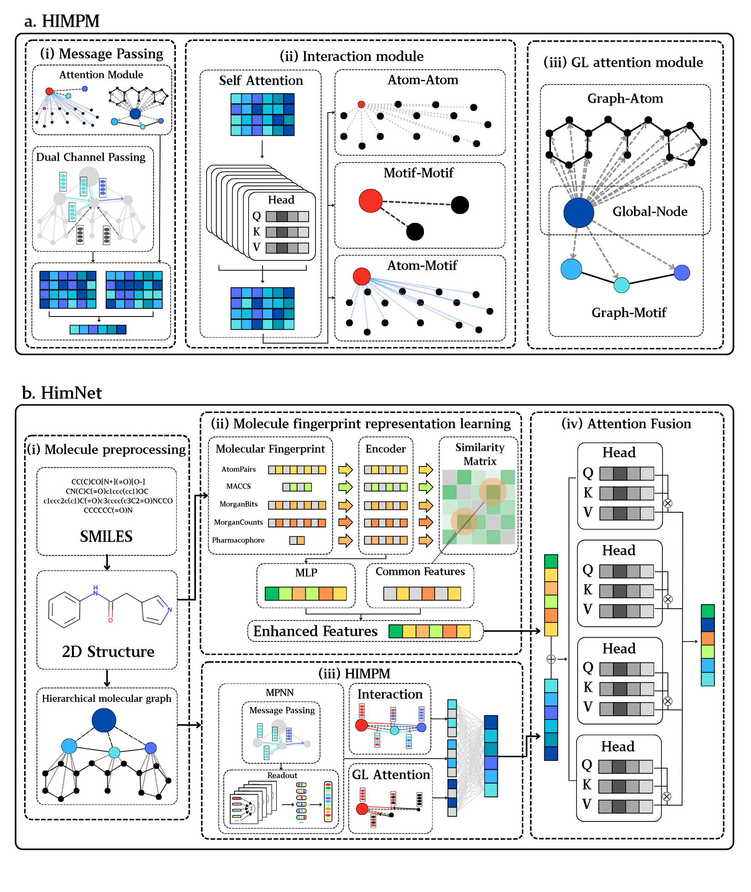
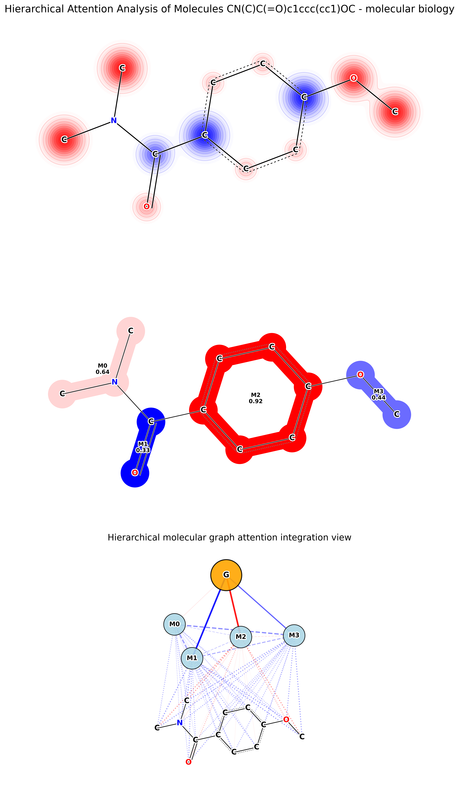

# HimNet : Learning Molecular Hierarchical Interaction for Accurete Molecular Property Prediction

Discovering molecules with desirable molecular properties, including ADMET (Absorption, Distribution, Metabolism, Excretion, and Toxicity) profiles, is of great importance in drug discovery. Existing approaches typically employ deep learning models, such as Graph Neural Networks (GNNs) and Transformers, to predict these molecular properties by learning from diverse chemical information. However, these models often fail to efficiently capture and utilize the hierarchical nature of molecular structures, and lack mechanisms for effective interaction among multi-level features. To address these limitations, we propose a Hierarchical Interaction Message Passing Mechanism, which serves as the foundation of our novel model, HimNet. Our method enables interaction-aware representation learning across atomic, motif, and molecular levels via hierarchical attention-guided message passing. This design allows HimNet to effectively balance global and local information, ensuring rich and task-relevant feature extraction for downstream property prediction tasks, such as Blood-Brain Barrier Permeability (BBBP). We systematically evaluate HimNet on eleven datasets, including eight widely-used MoleculeNet benchmarks and three challenging, high-value datasets for metabolic stability, malaria activity, and liver microsomal clearance, covering a broad range of pharmacologically relevant properties. Extensive experiments demonstrate that HimNet achieves the best or near-best performance in most molecular property prediction tasks. Furthermore, our method exhibits promising hierarchical interpretability, aligning well with chemical intuition on representative molecules. We believe that HimNet offers an accurate and efficient solution for molecular activity and ADMET property prediction, contributing significantly to advanced decision-making in the early stages of drug discovery.

<div align=center>

</div>

## Environment


```python
conda create -n himnet python=3.7
pip install -r environment.txt
```

## Data
HimNet’s performance was first benchmarked on eight standard MoleculeNet datasets---five classification tasks BACE, BBBP, Tox21, SIDER, ClinTox and three regression tasks ESOL, FreeSolv, Lipophilicity---to assess its ability on well-established physicochemical and bioactivity predictions

| Data class        | Dataset | Description | molecules | tasks | Metric | Type |
|-------------------|---------|-------------|------------:|--------:|-------:|------|
| **Physicochemical** | ESOL | Estimating aqueous solubility | 1,128 | 1 | RMSE | Regression |
| | FreeSolv | Hydration free energy | 642 | 1 | RMSE | Regression |
| | Lipophilicity | Octanol-water partition coefficient LogP | 4,200 | 1 | RMSE | Regression |
| **Bioactivity** | BACE | β-secretase 1 inhibitor activity | 1,513 | 1 | AUC | Classification |
| | Malaria | Anti-malarial EC<sub>50</sub> | 9,998 | 1 | RMSE | Regression |
| **Toxicity** | Tox21 | 12 toxicity endpoints | 7,831 | 12 | AUC | Classification |
| | SIDER | 27 adverse drug reaction labels | 1,427 | 27 | AUC | Classification |
| | ClinTox | Clinical trial toxicity | 1,478 | 2 | AUC | Classification |
| **Pharmacokinetic** | BBBP | Blood-brain barrier penetration | 2,039 | 1 | AUC | Classification |
| | LMC | Liver microsomal clearance (human, rat, mouse) | 8,755 | 3 | RMSE | Regression |
| | MetStab | Metabolic stability half-life | 2,267 | 1 | AUC | Classification |

## Results
### Model Performance Comparison (Part 1)

| Model | BACE | BBBP | Tox21 | SIDER | ClinTox | ESOL | Freesolv | Lipophilicity |
|-------|------|------|-------|-------|---------|------|----------|---------------|
| MolCLR | 0.890(0.003) | 0.736(0.005) | 0.798(0.007) | 0.680(0.011) | 0.932(0.017) | 1.110(0.010) | 2.200(0.200) | 0.650(0.080) |
| GEM | 0.856(0.011) | 0.724(0.004) | 0.781(0.001) | 0.672(0.004) | 0.901(0.013) | 0.798(0.029) | 1.877(0.094) | 0.660(0.008) |
| ImageMol | 0.839(0.005) | 0.739(0.002) | 0.773(0.001) | 0.660(0.001) | 0.851(0.014) | 0.970(0.070) | 2.020(0.070) | 0.720(0.010) |
| MolMCL<sub>GIN</sub> | 0.850(0.011) | 0.741(0.006) | 0.775(0.003) | 0.667(0.008) | **0.957(0.012)** | - | - | - |
| MolMCL<sub>GPS</sub> | 0.861(0.013) | 0.736(0.007) | 0.790(0.006) | **0.687(0.002)** | 0.951(0.005) | - | - | - |
| Uni-Mol | 0.857(0.002) | 0.729(0.006) | 0.796(0.005) | 0.659(0.013) | 0.919(0.018) | 0.788(0.029) | 1.480(0.048) | 0.603(0.010) |
| MESPool | 0.855(0.039) | 0.848(0.046) | 0.787(0.019) | 0.576(0.026) | 0.902(0.065) | 1.276(0.246) | 2.779(0.762) | 0.708(0.042) |
| HimGNN | 0.856(0.034) | 0.928(0.027) | 0.807(0.017) | 0.642(0.023) | 0.917(0.030) | 0.870(0.154) | 1.921(0.474) | **0.632(0.016)** |
| HiMol | 0.846(0.002) | 0.732(0.008) | 0.762(0.003) | 0.625(0.003) | 0.808(0.014) | 0.833 | 2.283 | 0.708 |
| FH-GNN<sup>a</sup> | 0.882(0.029) | 0.949(0.016) | 0.824(0.014) | 0.639(0.002) | 0.945(0.046) | 0.904(0.070) | 1.873(0.263) | 0.744(0.091) |
| **HimNet** | **0.890(0.026)** | **0.954(0.020)** | **0.826(0.018)** | 0.651(0.009) | 0.950(0.051) | **0.710(0.016)** | **1.441(0.223)** | 0.698(0.037) |

*Note: FH-GNN<sup>a</sup> represents results reproduced using our data partitioning scheme for fair comparison.*

### Model Performance Comparison (Part 2)

| Model | MetStab | Malaria | LMC-H | LMC-R | LMC-M | LMC<sub>mean</sub> |
|-------|---------|---------|-------|-------|-------|-------------------|
| MPNN | 0.823(0.020) | 1.056(0.037) | 104.0(5.8) | 162.9(27.4) | 125.9(20.6) | 130.9(4.1) |
| GCN | 0.696(0.055) | 1.057(0.043) | 103.7(5.7) | 161.6(26.2) | 126.4(20.2) | 130.6(3.6) |
| GAT | 0.767(0.031) | 1.048(0.040) | 102.6(5.5) | 159.4(24.6) | **124.8(17.3)** | 128.9(3.6) |
| GIN | 0.773(0.041) | 1.045(0.038) | 102.7(6.3) | 158.4(22.9) | 126.7(19.4) | 129.3(2.2) |
| **HimNet** | **0.896(0.008)** | **1.029(0.030)** | **91.7(11.9)** | **109.3(0.7)** | 132.1(39.5) | **111.0(9.8)** |

## Project document structure
```
HimNet/
├── data/ # Raw dataset storage
│   ├── bace/
│   ├── bbbp/
│   ├── clintox/
│   ├── esol/
│   ├── freesolv/
│   ├── lipophilicity/
│   ├── lmc/
│   ├── malaria/
│   ├── metstab/
│   ├── sider/
│   └── tox21/
│
├── dataset_splits/ # Preprocessed dataset splits
│   ├── bace/
│   ├── bbbp/
│   ├── clintox/
│   ├── esol/
│   ├── freesolv/
│   ├── lipophilicity/
│   ├── lmc/
│   ├── malaria/
│   ├── metstab/
│   ├── sider/
│   └── tox21/
│
├── dataset/ # Dataset processing code
│   ├── __init__.py
│   ├── featurization.py  # Feature engineering
│   ├── loader.py        # Data loader
│   └── splitters.py     # Data splitters
│
├── images/
│   ├── model.png
│   └── freesolv_mol_0.png
│
├── model/ # Model code
│   ├── __init__.py
│   └── HimNet.py       # HimNet model implementation
│
└── utils/ # Utility functions
│   ├── __init__.py
│   ├── dataset_split.py  # Dataset splitting tool
│   └── seed.py          # Random seed setting
│
├── eval.py            # Evaluation tool
├── main.py            # Main program entry
├── README.md          # Project description
├── train.py           # Training code
└── visual.py          # Visualization tool
```

## Training 

The script accepts the following arguments:

| Argument | Type | Default | Description |
|----------|------|---------|-------------|
| `--device` | int | `0` | Which GPU to use (0 for first GPU) |
| `--batch_size` | int | `64` | Input batch size for training |
| `--epochs` | int | `100` | Number of training epochs |
| `--lr` | float | `0.0001` | Learning rate |
| `--dataset` | str | `'bbbp'` | Dataset name:`tox21`, `bace`, `bbbp`, `sider`, `clintox`, `esol`, `freesolv`, `lipophilicity`, `lmc`, `metstab`, `malaria`  |
| `--data_dir` | str | `'./data/'` | Directory containing input data files |
| `--save_dir` | str | `'./model_checkpoints'` | Directory to save trained models |
| `--depth` | int | `7` | Depth of molecular graph encoder |
| `--seed` | int | `88` | Random seed for dataset splitting |
| `--runseed` | int | `None` | Seed for minibatch selection and initialization |
| `--eval_train` | int | `1` | Whether to evaluate on training set (0/1) |
| `--num_workers` | int | `4` | Number of workers for data loading |
| `--load_split` | flag | `False` | Load existing dataset split instead of creating new |
| `--split_dir` | str | `'./dataset_splits'` | Directory for dataset splits |

### Example Usage

```bash
python main.py \
  --device 0 \
  --dataset bace \
  --batch_size 64 \
  --epochs 100 \
  --lr 0.0001 \
  --depth 7 \
  --seed 42
```
**NOTE**: Before running the code, you need to create the `best_result/` and `model_checkpoints/` directories in the current working directory to record the best performance results and save model weights, respectively.
## Visualization

The script accepts the following arguments:

| Argument | Type | Default | Description |
|----------|------|---------|-------------|
| `--device` | int | `0` | Which GPU to use (0 for first GPU) |
| `--model_path` | str | **Required** | Path to trained model weights file (.pth/.pt) |
| `--dataset` | str | `'freesolv'` | Dataset name for visualization:`tox21`, `bace`, `bbbp`, `sider`, `clintox`, `esol`, `freesolv`, `lipophilicity`, `lmc`, `metstab`, `malaria` |
| `--data_dir` | str | `'./data/'` | Directory containing input data files |
| `--all_mols` | flag | `False` | Visualize all molecules in dataset |
| `--max_mols` | int | `100` | Maximum number of molecules to process (when --all_mols=True) |
| `--mol_idx` | int | `0` | Specific molecule index to visualize (when --all_mols=False) |
| `--batch_size` | int | `1` | Batch size for processing (recommend 1 for visualization) |
| `--save_dir` | str | `'./attention_viz/'` | Directory to save visualization results |
| `--property_name` | str | `'molecular biology'` | Target property name for display |


### Example Usage

```bash
python visual.py \
  --model_path ./checkpoints/freesolv.pth \
  --dataset freesolv \
  --property_name 'Physicochemical_freesolv'
```
### freesolv visualization results
<div align=center>

</div>
